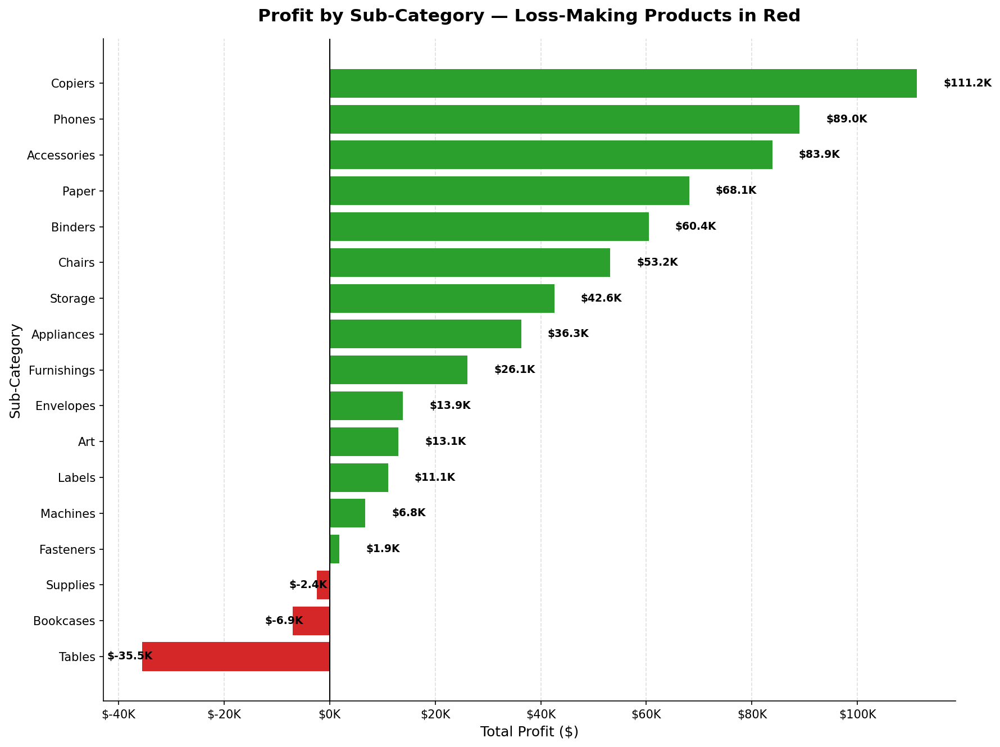
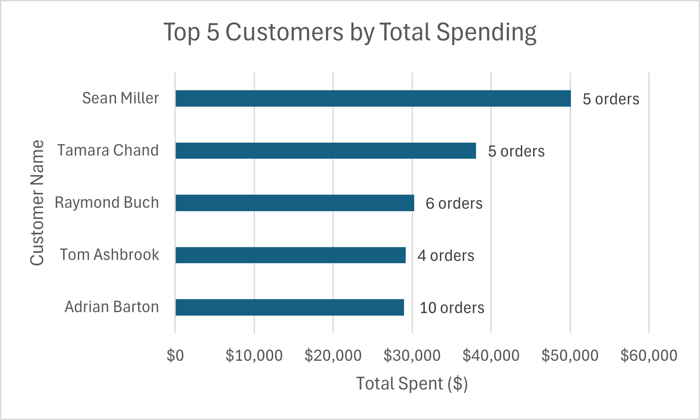
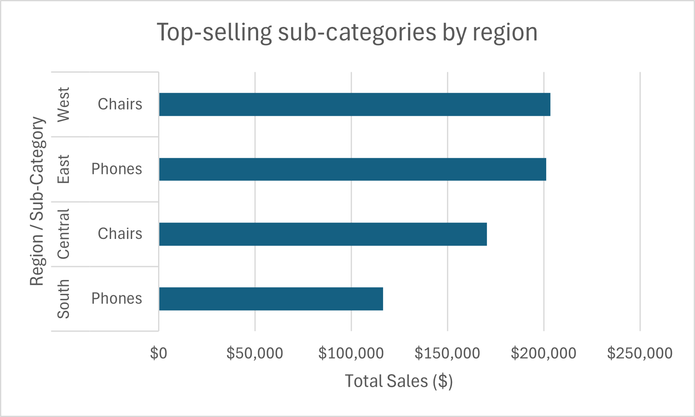
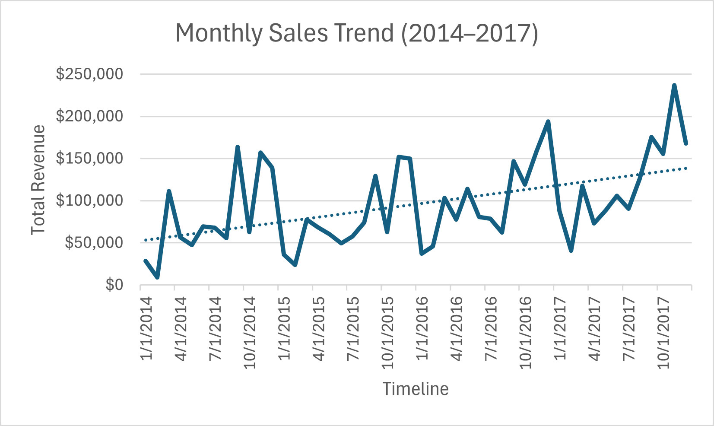

# 🛒 Superstore Sales Analysis

> An end-to-end data analysis project exploring retail sales data 
> using SQL and Python to uncover profit leaks, top customers, 
> regional performance, and growth opportunities.

---

## 📖 Summary

This project analyzes the Superstore sales dataset to answer key 
business questions about profitability, customer value, regional 
performance, and sales trends.

The workflow follows a complete analytics pipeline:

**Raw CSV → Database Setup → Data Profiling → Business Analysis → 
Python Visualization → Insights**

**Key Finding:** A small number of sub-categories and products drive 
the majority of losses, while a handful of customers and regions 
generate most of the profit.

---
### 📂 Dataset
- **Kaggle:** [Superstore Dataset](https://www.kaggle.com/datasets/vivek468/superstore-dataset-final)

### 📂 Database Schema 

| Table | Key Columns |
|-------|-------------|
| `superstore` | Order ID, Order Date, Ship Date, Ship Mode, Customer ID, Product ID, Sales, Profit, Quantity, Discount, Region, Category, Sub-Category |

### Query 1: Data Quality Check

**Purpose:** Verify total rows and check for NULL values.
```sql
SELECT 
    COUNT(*) AS total_rows,
    COUNT(*) - COUNT(order_id) AS null_order_id,
    COUNT(*) - COUNT(customer_id) AS null_customer_id,
    COUNT(*) - COUNT(product_id) AS null_product_id,
    COUNT(*) - COUNT(sales) AS null_sales,
    COUNT(*) - COUNT(profit) AS null_profit
FROM superstore;
```

**Results:**
| total_rows | null_order_id | null_customer_id | null_product_id | null_sales | null_profit |
|------------|---------------|------------------|-----------------|------------|-------------|
| 9,994 | 0 | 0 | 0 | 0 | 0 |

---

## 📊 Visualizations & Insights

### 📊 Top 10 Sub-Categories by Revenue
#### [ **Script** ](/SQL_FILES/07_top_10_sub_category_by_sales.sql)
| Rank | Sub-Category | Total Revenue |
|------|--------------|---------------|
| 1 | Chairs | $3,325,516.46 |
| 2 | Phones | $3,257,657.08 |
| 3 | Tables | $2,289,029.34 |
| 4 | Storage | $2,198,459.00 |
| 5 | Binders | $2,026,908.84 |
| 6 | Machines | $1,829,580.18 |
| 7 | Accessories | $1,757,844.98 |
| 8 | Copiers | $1,315,442.34 |
| 9 | Bookcases | $1,195,652.54 |
| 10 | Appliances | $1,094,736.92 |
- **Chairs ($3.33M) and Phones ($3.26M)** are the top revenue drivers — together **$6.58M (~33%)**.
- **All top 10 sub-categories exceed $1M in revenue**.
- **Tables ranks #3 in revenue but is the biggest loss-maker** — high sales ≠ high profit.
- **Top 5 sub-categories generate $13.1M** — over half of total revenue.


## 💰 Sub-Category Profit & Loss — Focus on Loss-Making Products**
--
Out of 17 sub-categories, only **three are loss-making**, but their combined impact is significant.
### [ **Script** ](/SQL_FILES/02_category_profitability.sql)

| Sub-Category | Total Profit | Share of Total Losses |
|--------------|--------------|-----------------------|
| **Tables** | **-$35,500** | **79%** |
| **Bookcases** | **-$6,900** | 15% |
| **Supplies** | **-$2,400** | 6% |
| **Total Loss** | **-$44,800** | **100%** |

**Key Findings:**

- **Tables is the single biggest loss-maker**, accounting for **79% of all losses** — a $35.5K deficit that wipes out the profit of several other sub-categories combined.
- **Bookcases and Supplies** add another **$9.3K in losses**, bringing the total damage to **$44.8K**.
- The three loss-making sub-categories span **two different categories** (Furniture and Office Supplies), suggesting the problem is not isolated to one product line.

**The Contrast — Top Profit Drivers:**

| Sub-Category | Total Profit |
|--------------|--------------|
| **Copiers** | **+$111.2K** |
| **Phones** | **+$89.0K** |
| **Accessories** | **+$83.9K** |
| **Paper** | **+$68.1K** |
| **Binders** | **+$60.4K** |

- **Copiers alone ($111.2K) generate 2.5x more profit** than the total losses of Tables, Bookcases, and Supplies combined.
- The **top 5 profitable sub-categories contribute $412.6K** — the business stays profitable only because a few strong performers offset the losses.

## 👤 Top 5 Customers by Spending

### [ **Script** ](/SQL_FILES/03_top_customers.sql)
- **Top Spender:** **Sean Miller** leads all customers with **~$50,000** in total spending across **5 orders** (~$10k average order value).
- **High-Value vs. High-Frequency:** **Adrian Barton** placed the most orders (**10 orders**), but generated less revenue (~$29k) than buyers with fewer, larger transactions.
- **Key Takeaway:** Top spending is driven primarily by **high average order value** rather than transaction volume.

### 🌍 Regional Sales Analysis

#### Top Performing Sub-Categories
#### [ **Script** ](/SQL_FILES/04_regional_sales.sql)
| Region | Sub-Category | Total Sales ($) |
| :--- | :--- | :--- |
| **West** | Chairs | 203,562.72 |
| **East** | Phones | 201,230.04 |
| **Central** | Chairs | 170,461.36 |
| **South** | Phones | 116,608.86 |

#### Key Insights

- **Category Dominance:** Regional sales are strictly driven by two core categories—**Chairs** in the West and Central regions, and **Phones** in the East and South regions.
- **Top Region:** **West** leads overall top sales at **$203,562.72**, closely followed by **East** at **$201,230.04**.
- **Lowest Region:** **South** generated the lowest top-performing revenue at **$116,608.86**.



## 📈 Revenue Growth & Seasonality (2014–2017)
### [ **Script** ](/SQL_FILES/05_monthly_sales_trends.sql)
- **60% Overall Growth:** Revenue expanded steadily from 2014 to 2017, with baseline monthly sales increasing over time.
- **Strong Q4 Seasonality:** Demand consistently spikes in Q4 (October–December) each year, reaching a record peak of ~$235,000 in late 2017.
- **Post-Holiday Q1 Slump:** Revenue sharply contracts in Q1 (January–February) immediately following the holiday season.
- **Rising Revenue Floor:** Despite seasonal dips, the lowest sales points grew from ~$10,000 in early 2014 to ~$40,000 in early 2017.


## 🚚 Shipping Mode Analysis
### [Script](/SQL_FILES/06_shipping_efficiency.sql)

| Ship Mode | Avg Shipping Days | Avg Profit ($) | Total Sales ($) |
| :--- | :--- | :--- | :--- |
| **Standard Class** | 5.01 | 27.49 | 2,716,432.16 |
| **Second Class** | 3.24 | 29.54 | 918,386.88 |
| **First Class** | 2.18 | 31.84 | 702,856.86 |
| **Same Day** | 0.04 | 29.27 | 256,726.24 |

#### Key Insights

- **Volume Driver:** **Standard Class** generates the vast majority of revenue ($2.72M) despite having the longest average shipping time (~5 days).
- **Highest Profitability:** **First Class** yields the highest average profit per order ($31.84) and delivers in roughly 2.2 days.
- **Fastest Delivery:** **Same Day** shipping boasts an impressive average delivery time under 1 day (~0.04 days), but accounts for the lowest sales volume ($256.7k).

## Project Structure
```
SuperStore_Sales_Analysis/
│
├── datasets/
│   └── superstore_data.csv                        # Raw dataset
│
├── OUTPUT/
│   ├── Charts/                                    # Visualization PNGs
│   │   ├── revenue_growth_tracking.png
│   │   ├── subcategory_loss_highlighted.png
│   │   ├── top_5_customers_total_spending.png
│   │   ├── top_subcategories_by_region.png
│   │   └── top-10-products-by-sales.png
│   │
│   └── CSV/                                       # Query results
│       ├── loss_making_products.csv
│       ├── monthly_sales_trend.csv
│       ├── regional_sales.csv
│       ├── top_5_Customer.csv
│       └── top_10_products_by_sales.csv
│
├── PYTHON_FILES/
│   └── Loss_products.ipynb                        # Loss analysis notebook
│
├── SQL_FILES/
│   ├── create_database.sql
│   ├── create_table.sql
│   ├── load_csv_file.sql
│   ├── 01_data_overview.sql
│   ├── 02_category_profitability.sql
│   ├── 03_top_customers.sql
│   ├── 04_regional_sales.sql
│   ├── 05_monthly_sales_trends.sql
│   ├── 06_shipping_efficiency.sql
│   └── 07_top_10_sub_category_by_sales.sql
│
└── README.md
```
- 🐙 **GitHub:** [github.com/adilshah150139](https://github.com/adilshah150139)
- 💼 **LinkedIn:** [linkedin.com/in/adilshah150139](https://linkedin.com/in/adilshah150139)
- 📧 **Email:** adilshah03032005@gmail.com
